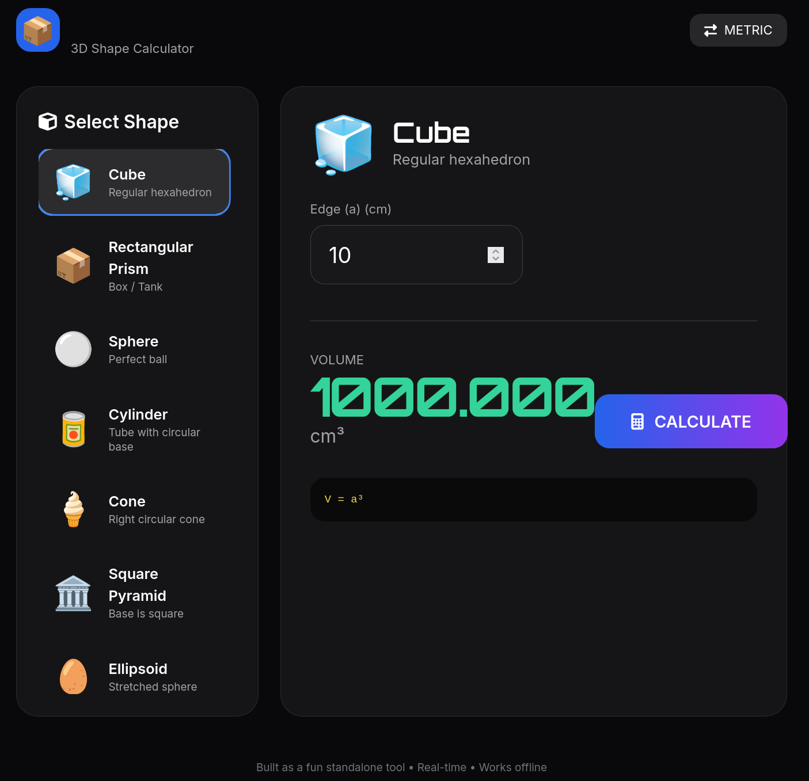

# NEON VOLUME • 3D Shape Calculator

A beautiful, modern, offline-first volume calculator with a cyberpunk/neon aesthetic. Built as a single HTML file — no build tools, no backend, just open and calculate.

 <!-- Add a screenshot here later -->

## ✨ Features

- **12+ 3D Shapes** including Cube, Sphere, Cylinder, Cone, Capsule, Ellipsoid, Pyramid, etc.
- **Real-time calculation** — updates instantly as you type
- **Metric & Imperial** units (cm/in) with one-click toggle
- **Futuristic glassmorphism UI** with smooth animations
- **Fully responsive** — works great on desktop and mobile
- **No installation required** — just open the HTML file
- **Works offline**

## 🚀 Quick Start

1. Download `volume-calculator.html`
2. Open it in any modern browser (Chrome, Firefox, Edge, Safari)
3. Start calculating!

**Or just click here:** [Live Demo](https://pdragonlabs.github.io/neon-volume/) *(add your GitHub Pages link after deploying)*

## 📸 Screenshots

<!-- Add 2-3 screenshots here after you take them -->

## 🛠 Technologies

- HTML5 + CSS3 + Vanilla JavaScript
- Tailwind CSS (via CDN)
- Font Awesome icons
- Google Fonts (Orbitron + Inter)

## 📐 Supported Shapes

| Shape              | Formula                          |
|--------------------|----------------------------------|
| Cube               | \( V = a^3 \)                    |
| Rectangular Prism  | \( V = l \times w \times h \)    |
| Sphere             | \( V = \frac{4}{3}\pi r^3 \)     |
| Cylinder           | \( V = \pi r^2 h \)              |
| Cone               | \( V = \frac{1}{3}\pi r^2 h \)   |
| Square Pyramid     | \( V = \frac{1}{3} \times base^2 \times h \) |
| Ellipsoid          | \( V = \frac{4}{3}\pi abc \)     |
| Capsule            | \( V = \pi r^2 h + \frac{4}{3}\pi r^3 \) |

## 🧩 How to Contribute

Contributions are welcome! You can:

- Add more shapes (frustum, torus, etc.)
- Improve mobile experience
- Add dark/light mode toggle
- Add "Copy Result" or "Export as Image" buttons
- Add unit presets (e.g. gallons, liters, cubic feet)

Just fork the repo and submit a Pull Request.

## 📄 License

This project is open source and available under the [MIT License](LICENSE).

---

**Made with 🔥 by PDragonLabs**

Star the repo if you found it useful! ⭐
